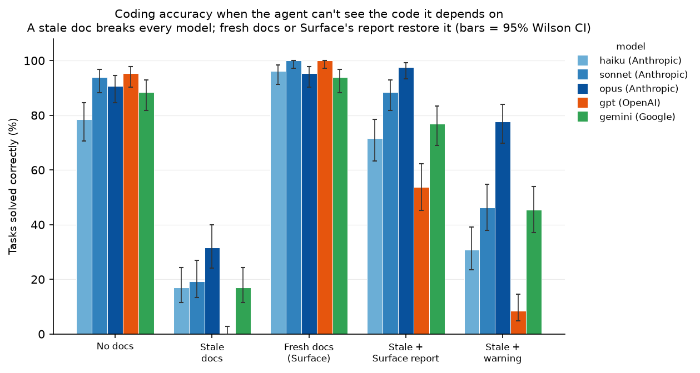
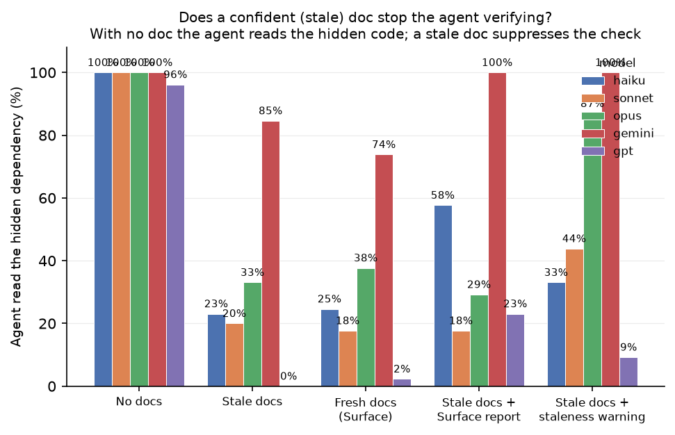
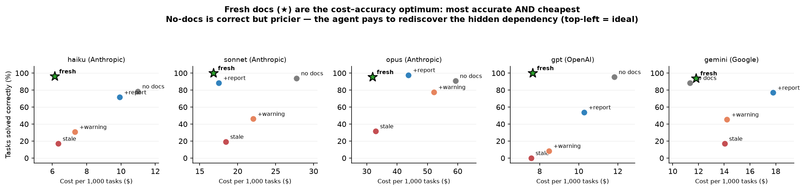

# Does documentation accuracy change LLM-agent performance?

### A pre-registered, provider-agnostic benchmark of documentation drift

**Author:** Connor McDonald
**Affiliation / artifact:** [`surface-bench`](https://github.com/Connorrmcd6/surface-bench) · companion tool: [Surface](https://github.com/Connorrmcd6/surface)
**Draft date:** 2026-06-16
**Status:** working paper — confirmatory multi-turn run complete (§6)

> **Reading note.** This study is **pre-registered**: the hypotheses, conditions, metrics, and
> analysis plan in §4 were frozen and git-tagged (`prereg-v2-multi`, `surf 0.6.2`) *before* the
> confirmatory run, neutralizing HARKing and analysis cherry-picking. The paper reports two real
> datasets: a single-shot **pilot** (§5; 3 Claude models, committed snapshot
> `results/2026-06-13-pilot-full-matrix/`, `surf 0.6.1`, which produces byte-identical scenario seals)
> and the **confirmatory multi-turn matrix** (§6; 5 models across 3 providers, 3,250 graded
> completions, snapshot `results/confirmatory-20260616T172420Z/`), which is the centerpiece of the
> study. Every confirmatory number in §6 is drawn from that snapshot's `summary.json`.

---

## Abstract

Software documentation rots: code moves, prose does not. LLM coding agents are unusually exposed to
this rot because they often treat documentation as ground truth — especially for parts of a codebase
they cannot, or do not, read directly. We ask a single, falsifiable question: **does keeping
documentation accurate change an agent's task performance, and through what mechanism?** We isolate
*documentation accuracy* as the only manipulated variable across five matched conditions (code only;
code + a stale doc; code + a fresh doc; code + a stale doc plus an automated drift report; and code +
a stale doc plus a generic "may be outdated" warning), holding the code, task, model, and sampling
fixed. Grading is fully deterministic — hidden unit tests for code-edit tasks and a fixed-format
verdict rubric for question-answering tasks — with **no LLM judge**. The benchmark is built to the
Agentic Benchmark Checklist (ABC; Zhu et al., 2025) and is pre-registered to forestall HARKing and
analysis cherry-picking.

In a **single-shot pilot** (3 Claude models, 4 conditions, 1,320 graded completions, 0 errors), when
the drifted dependency was *hidden* from the agent — the realistic large-codebase case — a stale doc
made **every model wrong on 100% of tasks** and confidently *misled* (asserted the stale claim) on
100% of tasks, while **a more capable model was no more resistant** than a weaker one. Accurate docs
restored 100% success, and handing the agent the automated drift report recovered nearly all of the
loss. Where the code was *visible*, rot did not break correctness but imposed a consistent token tax.

The confirmatory study extends this to a **multi-turn agentic** setting (5 models, 3 providers; 3,250
graded completions, 0 errors) in which the agent has read-only tools (`read_file`, `grep`,
`list_dir`) and may *choose* to verify the hidden dependency — removing the "follow the only available
source" tautology. The headline holds: with a stale doc in context the agent stops checking the hidden dependency
(it verifies ~100% of the time with no doc, far less with a doc) — though, tellingly, a *fresh*
doc suppresses verification just as much, so the operative mechanism is that **any authoritative
doc, not staleness per se, stops the agent checking** (the harm of a stale doc is that the thing it
stopped checking was false). All six pre-registered hypotheses are supported — the accuracy/recovery
effects (H1, H2, H3) confirmed on all five models under Holm correction and under a stricter
scenario-clustered bootstrap (§6.5), with a stale doc driving the *misled* rate to 68–100% even on
the most capable models. The agentic data further exposes **three distinct failure modes among the
five models** (we test one model per non-Anthropic provider, so these are model- not provider-level
claims): gpt-5.4 stops verifying entirely under a stale doc ("blind obedience"); Claude models
suppress verification but those who verify recover; and gemini-3.5-flash keeps verifying yet still defers to
the stale prose it just contradicted ("verify-then-defer"). Capability does not buy resistance — the
strongest models are among the worst affected.

---

## 1. Introduction

### 1.1 The problem: documentation rot meets autonomous readers

Documentation drift is the silent gap between what a codebase *does* and what its docs *say*. An
operator changes from `<` to `<=`, a default page size drops from 50 to 25, an allow-list becomes a
block-list — and the surrounding prose, the design note, the docstring, the wiki page, keeps
describing the world as it was. Human engineers tolerate this because they routinely distrust docs
and re-read code. LLM coding agents are different in two ways that make drift more dangerous, not
less:

1. **They consume docs as ground truth.** A doc placed in context is, to a model, just more authoritative-looking text. Absent a reason to doubt it, the model will act on it.
2. **They often cannot see the relevant code.** In a real repository the file that actually implements a behavior is frequently *not* in the agent's context window — it is a transitive dependency, hidden behind an interface the agent only knows by its documentation.

When both hold, a stale doc is not a minor annoyance; it is the agent's *only* window onto a behavior
that has changed underneath it. The agent then does exactly what it was asked — using a fact that is
no longer true.

This failure mode is recognized in production practice, not only in the lab. Industry accounts of
*context poisoning* name *context rot* — "information becomes outdated but remains in your knowledge
base" — as a primary cause of degraded LLM output, observing that once stale content enters the
context window "the LLM references it as truth, creating cascading errors" (Murúa, 2026). This study
turns that qualitative observation into a controlled, quantified measurement.

### 1.2 The intervention under test

[Surface](https://github.com/Connorrmcd6/surface) is a deterministic documentation-drift gate: given
anchored claims in docs and the code they point at, `surf check` reports when an anchored claim no
longer matches its code. Surface does **not** make an agent smarter; it stops docs *silently*
rotting. Its value to an agent is therefore a measurable quantity:

> the performance gap between an agent working from **accurate** docs and one working from **rotted**
> docs, plus whether **surfacing** the drift (rather than merely fixing the docs) recovers the loss.

This benchmark measures that quantity directly, using drift of exactly the kind `surf check` catches
— a flipped operator, a changed constant, an inverted condition, a dropped guard.

### 1.3 The precise claim, and what would falsify it

We do not claim "docs matter." We make a graded, falsifiable set of claims (the pre-registered
hypotheses of §4): that accurate docs beat rotted docs on task success; that rotted docs are *worse
than no docs at all* on the rate at which the agent is actively misled; that surfacing the drift
recovers the loss; that a confident stale doc *suppresses* the agent's own verification behavior; that
the resulting harm flows through skipped verification; and that recovery comes from the *corrected
code* in the drift report, not from mere suspicion. Each has a pre-specified direction. A null or
reversed result on any of them is reportable and would falsify that specific claim.

### 1.4 Contributions

- **A controlled, single-variable benchmark** of documentation accuracy for coding agents, where the
  only thing that varies across conditions is the documentation block.
- **A "cascade" scenario design** that reproduces the realistic failure shape — a *hidden* dependency
  whose behavior has drifted — and a "comprehension" family that isolates the token-cost story.
- **Fully deterministic grading** (hidden tests / fixed-format verdicts, no LLM judge) with ground
  truth derived from the real code, not hand annotation.
- **A pre-registered, ABC-compliant protocol** with oracle tripwires, multiplicity control, and a
  transparent confirmatory/exploratory split.
- **Provider-agnostic generalization**: the same scenarios run across Anthropic, OpenAI, and Google
  models, testing whether "a more capable model is no more rot-resistant" holds beyond one vendor.
- **A multi-turn agentic track** in which the agent can choose to verify, making the headline result
  non-tautological and letting us measure *verification suppression* as the mechanism.

---

## 2. Background and related work

### 2.1 Agentic benchmark rigor

Agentic benchmarks are easy to get subtly wrong: tasks that are unsolvable as specified, graders that
pass on trivial or empty answers, ground truth that leaks, non-deterministic tests, and reporting that
over-claims capability. Zhu et al. (*Establishing Best Practices for Building Rigorous Agentic
Benchmarks*, NeurIPS 2025 Datasets & Benchmarks; arXiv 2507.02825) catalogue these failure modes as
the **Agentic Benchmark Checklist (ABC)**, grouped into *task validity*, *outcome validity*, and
*reporting*. We adopt ABC as a design constraint and provide a per-item self-audit in
`ABC_CHECKLIST.md`; §3 and §8 of this paper map our design choices onto its items.

### 2.2 Pre-registration and construct validity

Two threats are endemic to benchmark write-ups. *HARKing* (hypothesizing after results are known)
lets a study present whatever pattern emerged as if it had been predicted. *Analysis cherry-picking*
lets a study choose, post hoc, the slice or test that happens to be significant. Pre-registration —
fixing hypotheses, conditions, metrics, and the analysis plan in advance, then git-tagging them
before the confirmatory run — neutralizes both. We pre-register direction for every confirmatory
hypothesis and label everything else exploratory (§4).

### 2.3 How this differs from capability benchmarks

Most coding benchmarks vary the *model* (or the agent scaffold) and hold the task fixed, asking "how
capable is the system?" We invert that: we hold the model fixed and vary the *quality of the
information* it is given, asking "how much does an information-quality defect (doc rot) move outcomes,
and can a tool that surfaces the defect recover them?" The headline is therefore **not** a capability
ranking; indeed, a central finding is that capability does *not* buy resistance to this defect.

### 2.4 Context-poisoning defenses, and where this study sits

A growing body of production-oriented work addresses *context poisoning* at the **retrieval stage** —
controlling which documents enter the context window. Murúa (2026), for example, mitigates context
rot in RAG pipelines with temporal filters (e.g., restrict to documents updated within the last
six months), metadata boosting (prefer version- or deployment-specific docs), and hybrid lexical +
semantic search. These defenses are **orthogonal and upstream** to what we study: they decide *what
gets retrieved*. Our benchmark measures agent behavior when a drifted doc is *already* in context,
and tests a *drift-detection* remedy (Surface) rather than a recency filter. The distinction matters
because recency is a weak proxy for correctness: a doc can be recently edited and still wrong because
the **code moved underneath it** — precisely the case our cascade scenarios isolate, and one a
`last_updated`-based filter cannot catch.

---

## 3. Methodology

### 3.1 Conditions — the only thing that varies

Every cell of the matrix uses the **same code, the same task, and the same model**; only the
documentation block in the prompt changes. There are five conditions:

| | Context shown to the agent | Represents |
|---|---|---|
| **C0** | code only (no doc) | baseline |
| **C1** | code + **stale** doc (true at T0, code has moved to T1) | the ungoverned world |
| **C2** | code + **fresh** doc (matches T1) | the Surface-governed world |
| **C3** | code + stale doc + real `surf check --format json` report | "just surface the drift" |
| **Cw** | code + stale doc + a generic "may be outdated" warning (no corrected code) | control: is it the *fix* or just *suspicion*? |

Each scenario has a current, drifted state (**T1**) and a pre-drift state (**T0**). The stale doc
truthfully described T0; the code has since moved to T1. The C3 report is **genuine** `surf check`
output — the documentation hubs are sealed against the real `surf` binary by `tools/author.py`, not
mocked — and it includes the corrected `new_code`. Cw strips that corrected code and replaces it with
a content-free "this may be outdated" note, so that C3 − Cw isolates whether recovery comes from the
*fix* Surface supplies or merely from making the agent *suspicious*.

### 3.2 Two run modes, and why multi-turn is the centerpiece

- **Single mode (secondary).** One prompt → one completion. Cheap and reproducible; this is the mode
  of the pilot in §5. Its limitation is a tautology: when the drifted dependency is hidden, the doc is
  the agent's *only* source of truth, so "follow the stale doc" is partly rational, and the effect can
  be dismissed as true-by-construction.
- **Multi mode (primary / centerpiece).** A multi-turn agent loop (`max_turns = 8`) with a
  **read-only** tool surface — `read_file`, `grep`, `list_dir`, and `final_answer`. A per-trial
  sandbox contains `code/` **including the hidden dependency**, which the prompt still withholds. The
  agent may therefore *choose* to open the dependency and verify the doc's claim. This removes the
  tautology: a rational, diligent agent could always be right, so any residual harm from a stale doc
  must come from the agent *declining to verify*. That is the non-tautological core of the study.

Tools are deliberately **read-only**: giving the agent a test runner would let it brute-force ground
truth and wash out the doc-trust signal we are trying to measure. A full edit/run/test "thrash" loop —
which would let us price the *compounding* cost of rot — is deferred future work.

### 3.3 Two scenario families

- **Cascade (the headline).** The agent edits or answers about a **visible** thing whose correctness
  depends on a **hidden dependency**. The dependency's source lives in `code/` (so `surf` can seal a
  real divergence and the grader can run the agent's output against reality) but is withheld from the
  prompt via a `hidden_paths` glob in `meta.toml`. The dependency has drifted from what the stale doc
  says, so in single mode the doc is the agent's *only* window onto the truth, and in multi mode it is
  an *optional* one (the agent can read the dependency if it chooses). This is the realistic
  context-rot shape.
- **Comprehension.** The drifted code *and* its contradicting doc are both visible. The model can
  simply re-read the code, so success ceilings near 100% — these scenarios are weak for the success
  story but useful for the **token-tax** story: a stale doc costs extra generation to reconcile
  against visible code.

### 3.4 Worked example — `cascade-quota-batcher-code`

The agent sees `throttle.py` and is asked to implement `plan_batches(total)`, which must split queued
requests into batches sized to a rate limiter's **per-window capacity**. The limiter
(`FixedWindowLimiter`, configured `WINDOW_LIMIT = 10`) lives in a package whose source is **not in the
checkout** (`hidden_paths = ["code/limiter/*.py"]`), so the capacity is knowable only from its doc.

The drift: the limiter's admission guard moved from `count < limit` to `count <= limit`, so its true
per-window capacity for `WINDOW_LIMIT = 10` is **11**, not 10.

- **C1 (stale doc)** asserts the capacity is *exactly* N — "at `WINDOW_LIMIT = 10` the limiter admits
  10." An agent that trusts it batches at 10 (**wrong**, and *misled*).
- **C2 (fresh doc)** asserts the inclusive bound — "admits N+1 … at `WINDOW_LIMIT = 10` the limiter
  admits 11." An agent batches at 11 (**correct**).
- **C3** keeps the stale prose but appends the `surf` report, whose `new_code` shows
  `if count <= self.limit:` — the only window onto the truth when the file is hidden.
- **Cw** keeps the stale prose and appends a generic "this documentation may be outdated" note with no
  corrected code.

The task text itself is **neutral**: it asks the agent to "determine the limiter's true per-window
capacity" and never states either the stale or the fresh value. The grader derives the expected batch
size from the *real* hidden limiter, so the test stays honest regardless of what either doc claims.

### 3.5 Prompt construction and neutrality

The prompt is a `(system, user)` pair. The system prompt is deliberately minimal and **persona-free**:

```
Use the files and documentation provided to do the task below.
```

There is no "you are an expert engineer" framing (which primes skeptical, diligent behavior and biases
*against* a stale-doc effect) and **no precedence** declared between docs and code. This mirrors how
people actually prompt agents: paste or tag some files, maybe a doc, ask for the change.

The user turn has a fixed anatomy: a `## Codebase` section (cascade scenarios omit the hidden
dependency here); a `## Project documentation` section carrying the stale or fresh hub (omitted
entirely in C0); for C3, an `## Automated documentation check` section carrying the genuine
`surf check --format json` output; and a `## Task` section stating the goal and the exact output
contract.

**Neutrality is enforced** (a lesson from an early pilot failure): the stale value appears *only*
in the stale hub — never in `task.md`, never in the visible code, and never as a "the doc may be wrong"
hint. A leak re-introduces exactly the doc-trust bias the neutral system prompt is designed to remove.

### 3.6 Deterministic grading and metrics

Grading is fully deterministic — **there is no LLM judge**.

- **Code-edit scenarios.** The agent returns whole files in `FILE: <path>` blocks. The harness
  overlays them onto a fresh copy of `code/` and runs two hidden checks: a `correct` check (passes iff
  the T1 behavior is implemented → **success**) and a `misled` check (passes iff the T0 behavior is
  implemented → **misled**). Cascade graders import and probe the *real hidden dependency* to derive
  ground truth; they never hardcode the fresh value. (The `misled` check hardcodes the *stale* value.)
- **QA scenarios.** The agent ends with a fixed-format `VERDICT: <field>=<value>; …` line. A per-field
  regex rubric adjudicates `correct` (matches T1) vs `misled` (matches the stale T0 claim). "Last
  match wins" tolerates the model restating the format; a missing or garbled verdict parses as neither
  (it is not a pass).

Metrics per cell:

- **success** (`ok`) — produced the current (T1) answer. The H1/H3/H6 axis.
- **misled** (`misled`) — asserted the *stale* (T0) claim. The H2 axis: a rotted doc doesn't merely
  fail to help, it *causes* the wrong answer.
- **verification_rate** (multi only) — the agent called `read_file`/`grep` on a path matching the
  scenario's `hidden_paths` glob *before* `final_answer`. The H4 axis, and the headline of the
  agentic track. Its validity check is **`verified_then_correct`** (success among verifiers) — reading
  the truth should rescue the answer.
- **output tokens** and **cost** — secondary. Input tokens differ by construction (the doc block's
  size), so only output tokens carry a behavioral signal.

### 3.7 Models, scale, and sampling

- **Models (5, across 3 providers).** Anthropic — `haiku` (`claude-haiku-4-5-20251001`), `sonnet`
  (`claude-sonnet-4-6`), `opus` (`claude-opus-4-8`); OpenAI — `gpt` (`gpt-5.4`); Google — `gemini` (`gemini-3.5-flash`). Exact model
  ids and prices are pinned in `config.toml` at freeze time and copied into `run.json`.
- **Trials (tiered).** N = 10 per cell for the **cascade** family (the headline); N = 5 for the
  **comprehension** family (success-ceilinged — kept only for the token story). Comprehension may be
  omitted from multi mode entirely, since it does not test verification; that choice is recorded in
  `run.json`, not chosen by results.
- **Sampling.** `temperature = 1.0` (stochasticity is part of what we measure); `max_tokens = 1024`;
  `max_turns = 8` (multi mode).

### 3.8 Scenario validation and oracle tripwires

Two offline gates run before any spend, and one runs after every paid run:

- **`tools/author.py`** seals each scenario's documentation hub hashes against the real `surf` binary
  and emits the genuine `surf_report.json`. It **fails loudly** if the stale hub does not actually
  diverge — i.e., if the drift is not the kind `surf check` would catch.
- **`tools/validate_scenario.py`** runs the live graders on the two committed reference solutions and
  proves they **discriminate**: the correct solution scores `ok` and not `misled`; the stale solution
  scores `misled` and not `ok`. This certifies the grader's polarity offline.
- **`surface_bench.oracle`** is a post-run tripwire that exits non-zero if, per scenario × model,
  (a) C2-fresh success < 90% (with a *fresh* doc the task must be solvable; a low cell means the
  scenario is mis-authored, not a real effect), or (b) a cascade C1 *never* misleads (if a stale doc
  never produces the wrong answer, the drift is not load-bearing and the scenario measures nothing).

Spend is staged and gated: `mock` (offline pipeline check) → one scenario × each provider (smoke the
tool round-trip) → cascade-only multi at small N (pilot the verification metric) → the full matrix,
with the oracle as the gate at each step.

---

## 4. Pre-registration and analysis plan

The following was frozen before the confirmatory run (`PREREGISTRATION.md`). Direction is pre-specified
for **every** confirmatory hypothesis; anything not listed (per-provider contrasts, tier gradients,
token-cost deltas) is **exploratory** and reported as such.

### 4.1 Confirmatory hypotheses

| | Claim | Test | Read on |
|---|---|---|---|
| **H1** | accuracy beats rot (the core value) | success(C2) > success(C1) | success rate |
| **H2** | rot is worse than nothing (the headline) | misled(C1) > misled(C0) | misled rate |
| **H3** | surfacing drift recovers it | success(C3) ≈ success(C2), and ≫ C1 | success rate |
| **H4** | a confident stale doc suppresses verification | verification_rate(C1) < verification_rate(C0) | verification rate (multi) |
| **H5** | the harm flows through skipped verification (mediation) | within C1, success(verified) > success(not verified) | mediation (multi) |
| **H6** | recovery is the corrected code, not mere suspicion | success(C3) > success(Cw) | success rate |

### 4.2 Statistical analysis

- **Rates** are reported with 95% **Wilson** confidence intervals.
- **Each hypothesis** is tested as an unpaired difference of proportions with a 95% **bootstrap**
  confidence interval *and* a bootstrap two-sided p-value (10,000 resamples, fixed seed). *These
  pre-registered interval methods treat the N completions per cell as independent Bernoulli trials.
  Because completions cluster within scenarios (and the scenario set is small), §6.5 adds a post-hoc,
  exploratory **scenario-clustered bootstrap** — resampling whole scenarios rather than completions —
  as a robustness check on every confirmatory delta; it was not part of the frozen plan.*
- **Multiplicity** is controlled with **Holm–Bonferroni** across the family of confirmatory
  success-delta tests (every model × pre-registered pair). A hypothesis is **confirmed** if its CI
  excludes 0 **and** it survives Holm; it is reported as **suggestive** if CI-significant but not
  Holm-significant.
- **H5 (mediation)** is reported as the within-C1 success split (verified vs not) per model.
- **Per-scenario and per-tier breakdowns** are reported for transparency (exploratory), so that no
  single broken fixture or single difficulty level can hide inside a family average.

### 4.3 Exclusions, stopping rule, and scope

- **Exclusions.** A cell that errors (API failure) is logged with `error` and **excluded** from
  rates; the count of excluded cells is reported. No silent retries beyond the client's built-in
  retry.
- **Fixture defects.** Any scenario failing the oracle (C2-fresh ≥ 90%, or cascade C1-misled > 0) is
  treated as a fixture defect and flagged; whether to drop it is decided by the pre-stated oracle
  rule, not by whether dropping it helps the result.
- **Stopping rule.** The matrix runs to completion at the fixed N above. No data-dependent stopping,
  no N top-ups chosen by looking at significance. If a *staging* smoke reveals a harness bug, it is
  fixed and that stage re-run; the confirmatory full run begins only after the pre-registration is
  tagged.
- **Scope.** The study assesses whether documentation accuracy changes single-shot and multi-turn
  task outcomes on curated cascade fixtures across five models, and whether the effect is mediated by
  verification. It does **not** assess real-repository generalization (curated fixtures by design),
  an edit/run/test agent loop (read-only by design), or languages beyond Python and TypeScript.

---

## 5. Preliminary results (single-shot pilot, 2026-06-13)

These are **real** results from the committed snapshot `results/2026-06-13-pilot-full-matrix/`. They
are **preliminary and motivating**, not confirmatory: this pilot ran the *secondary* (single-shot)
mode, four conditions (C0–C3; the **Cw** control and the multi-turn verification metrics were not yet
in the harness), and three Anthropic models. It therefore speaks to H1–H3 but **not** to H4, H5, or
H6.

**Configuration.** 11 scenarios (4 cascade, 7 comprehension) × 4 conditions × 3 models × N = 10 =
**1,320 graded completions, 0 errors**. `temperature = 1.0`, `max_tokens = 1024`, `surf 0.6.1`. Data
were assembled from an original run plus a resume after a timeout fix; every scenario has exactly 120
rows, 0 duplicates (see `PROVENANCE.md`).

### 5.1 Cascade family (hidden dependency) — n = 40 per condition per model

Success with 95% Wilson interval; "mis" = misled rate; "tok" = mean output tokens.

| Model | C0 (code only) | C1 (stale) | C2 (fresh) | C3 (stale + surf) |
|---|---|---|---|---|
| haiku | 2% [0–13] · mis 38% · 472 tok | **0% [0–9] · mis 100%** · 408 | **100% [91–100]** · 0% · 427 | **90% [77–96]** · 0% · 583 |
| sonnet | 0% [0–9] · mis 62% · 628 | **0% [0–9] · mis 100%** · 274 | **100% [91–100]** · 0% · 273 | **100% [91–100]** · 0% · 492 |
| opus | 0% [0–9] · mis 18% · 716 | **0% [0–9] · mis 100%** · 398 | **100% [91–100]** · 0% · 419 | **100% [91–100]** · 0% · 634 |

Success deltas: **H1 (C2 − C1) = +100 pp on every model**; **H3 (C3 − C1) = +90 pp (haiku), +100 pp
(sonnet, opus)**.

### 5.2 Comprehension family (visible code) — n = 70 per condition per model

| Model | C0 (code only) | C1 (stale) | C2 (fresh) | C3 (stale + surf) |
|---|---|---|---|---|
| haiku | 86% [76–92] · mis 13% · 425 | 86% [76–92] · mis 10% · 496 | 100% [95–100] · 0% · 431 | 96% [88–99] · 0% · 489 |
| sonnet | 93% [84–97] · 0% · 434 | 99% [92–100] · 0% · 479 | 100% [95–100] · 0% · 372 | 100% [95–100] · 0% · 426 |
| opus | 100% [95–100] · 0% · 403 | 94% [86–98] · 0% · 472 | 99% [92–100] · 0% · 415 | 96% [88–99] · 0% · 463 |

Success ceilings near 100% across the board — the model can just read the visible code. The signal
here is **tokens**: a stale doc costs **+65 (haiku), +107 (sonnet), +57 (opus)** extra output tokens
versus a fresh doc (C1 − C2).

### 5.3 Spend

| Model | Spend |
|---|---|
| haiku | $1.49 |
| sonnet | $4.21 |
| opus | $8.28 |
| **Total** | **$13.98** |

### 5.4 What the pilot establishes (and does not)

- **Establishes (preliminary):** when the dependency is hidden, a stale doc drives cascade success to
  **0%** and misled rate to **100%** on every model, with **fresh docs at 100%** and the **surf report
  recovering to 90–100%** — and crucially, **capability does not help** (haiku, sonnet, and opus
  collapse identically). Where code is visible, rot does not break correctness but levies a token tax.
- **Does not establish:** anything about verification behavior (H4/H5), the warning-only control
  (H6/Cw), the multi-turn setting where the agent *could* verify, or generalization beyond Anthropic.
  Those are precisely what the confirmatory study (§6) adds.

---

## 6. Headline results — multi-turn agentic study

These are the **confirmatory** results, run after the pre-registration was git-tagged
(`prereg-v2-multi`) and reported directly from `results/confirmatory-20260616T172420Z/summary.json`.
Statistics follow §4 (Wilson rates, bootstrap delta CIs, Holm–Bonferroni across the confirmatory
success-delta family). **All four success/misled hypotheses (H1, H2, H3, H6) are confirmed on every
model.** The verification hypotheses (H4/H5) hold too, but reveal a striking cross-provider
heterogeneity that is the most novel finding of the study (§6.3–6.4).

### 6.1 Run provenance

| Field | Value |
|---|---|
| Pre-registration tag | `prereg-v2-multi` · `surf 0.6.2` |
| Mode / sampling | multi-turn, `max_turns = 8`, `temperature = 1.0`, `max_tokens = 1024` |
| Models | `haiku` (claude-haiku-4-5-20251001), `sonnet` (claude-sonnet-4-6), `opus` (claude-opus-4-8), `gpt` (gpt-5.4), `gemini` (gemini-3.5-flash) |
| Conditions | C0, C1, C2, C3, Cw |
| Scenarios | 13 cascade (the QA scenario `cascade-idempotency-window-qa` was pre-excluded from multi mode as non-load-bearing — the agent verifies it 100% of the time regardless of the doc — a choice recorded in `run.json`, not chosen by results) |
| Scale | 13 × 5 × 5 × N=10 = **3,250 graded completions, 0 errors, 0 excluded cells** |
| Spend | **$62.16** (opus $28.59, sonnet $13.33, gemini $8.99, gpt $5.95, haiku $5.29) |

Gemini ran with thinking disabled (`thinking_budget = 0`) so its single completion budget matches the
others (Claude uses no extended thinking; gpt-5.4 reasons within `max_completion_tokens`).

### 6.2 Success and misled rates — per model × condition (cascade)

success [95% Wilson] · misled · mean output tokens; n = 130 per cell.

| Model | C0 | C1 (stale) | C2 (fresh) | C3 (stale+surf) | Cw (warning) |
|---|---|---|---|---|---|
| haiku  | 78% [71–85] · mis 2% · 763  | **17% [11–24] · mis 82%** · 601 | **96% [91–98]** · 0% · 568  | 72% [63–79] · mis 26% · 777 | 31% [23–39] · mis 69% · 666 |
| sonnet | 94% [88–97] · mis 0% · 607  | **19% [13–27] · mis 81%** · 555 | **100% [97–100]** · 0% · 508 | 88% [82–93] · mis 12% · 572 | 46% [38–55] · mis 52% · 580 |
| opus   | 91% [85–95] · mis 0% · 810  | **32% [24–40] · mis 68%** · 610 | **95% [90–98]** · 0% · 561  | 98% [93–99] · mis 2% · 783 | 78% [70–84] · mis 13% · 851 |
| gpt    | 95% [90–98] · mis 4% · 320  | **0% [0–3] · mis 100%** · 222   | **100% [97–100]** · 0% · 226 | 54% [45–62] · mis 46% · 240 | 8% [5–15] · mis 91% · 234 |
| gemini | 88% [82–93] · mis 0% · 429  | **17% [11–24] · mis 77%** · 458 | **94% [88–97]** · 0% · 372  | 77% [69–83] · mis 14% · 509 | 45% [37–54] · mis 45% · 514 |

A confident stale doc (C1) collapses success to 0–32% and drives the *misled* rate to 68–100% on
every model — **including opus and gpt**, the most capable systems tested. Fresh docs (C2) restore
94–100%. The pattern of the single-shot pilot survives intact in the agentic setting, where the agent
could have verified.




### 6.3 Verification rate — per model × condition (cascade, multi only)

Fraction of trials that read the hidden dependency before answering [95% Wilson]; `v→ok` = success
among C1 verifiers (H5's validity check).

| Model | C0 | C1 | C2 | C3 | Cw | C1 `v→ok` |
|---|---|---|---|---|---|---|
| haiku  | 100% [97–100] | 23% [17–31] | 25% | 58% | 33% | 47% |
| sonnet | 100% [97–100] | 20% [14–28] | 18% | 18% | 44% | 62% |
| opus   | 100% [97–100] | 33% [26–42] | 38% | 29% | 87% | 95% |
| gpt    | 96% [91–98]   | **0% [0–3]**  | 2%  | 23% | 9%  | n/a (no verifiers) |
| gemini | 100% [97–100] | **85% [77–90]** | 74% | 100% | 100% | 20% |



**H4 (verification suppression, C0 − C1) is significant on every model** but spans an order of
magnitude: gpt **+96 pp** [+92, +99], sonnet +80 pp [+73, +86], haiku +77 pp [+69, +84], opus
+67 pp [+58, +75], gemini **+15 pp** [+9, +22]. With **no** doc, all five models verify ~100% of the
time; a doc is what stops them.

**It is the doc, not its staleness, that suppresses verification (exploratory).** H4 contrasts a
*stale* doc against no doc, but the suppression is not specific to staleness: a *fresh* doc (C2)
suppresses verification essentially as much. The C0 − C2 drop is +75 pp (haiku), **+82 pp (sonnet,
i.e. a fresh doc suppresses *more* than the stale one)**, +62 pp (opus), +94 pp (gpt), and +26 pp
(gemini) — within a few points of each model's C0 − C1. The mechanism is therefore that *any*
authoritative doc in context makes the agent stop opening the dependency it would otherwise read; a
stale doc is harmful not because it suppresses checking *more* but because the claim it suppresses
checking *against* is false. This both sharpens the practical case for accuracy (the agent will trust
whatever doc you give it, so it had better be right) and means H4's pre-registered "stale-specific"
framing is, mechanistically, too narrow.

**This exposes three distinct failure mechanisms** — the study's most important new result. *Two
caveats on scope: (i) we test one model per non-Anthropic provider, so "blind obedience" and
"verify-then-defer" are properties of gpt-5.4 and gemini-3.5-flash specifically, not established
provider-level traits; and (ii) inference-time compute is not held constant across vendors (§6.1) —
gpt-5.4 reasons within its completion budget while Claude and gemini do not — so gpt's total
verification shutoff is partly confounded with its reasoning configuration and should be read as a
model-plus-config behaviour, not a pure "OpenAI" effect.*

- **gpt — blind obedience.** A stale doc shuts off verification *entirely* (0%); gpt commits to the
  wrong answer without ever opening the file it could have read in C0 96% of the time.
- **Claude (haiku/sonnet/opus) — suppressed but rescuable.** A stale doc suppresses verification, but
  the minority who *do* verify are mostly correct (C1 `v→ok` 47–95%, opus best). Verification is a
  genuine antidote here.
- **gemini — verify-then-defer.** Gemini barely suppresses (still verifies 85% under C1) yet is still
  77% misled, because reading the truth does *not* rescue it: only **20%** of its C1 verifiers answer
  correctly. Gemini opens the hidden file, sees the real code, and *still* follows the stale prose.
  This is a second failure mode the pre-registration did not anticipate: the harm is not only skipped
  verification but **discounted verification**.

### 6.4 Mediation (H5) — within-C1 success split

Success among C1 trials that verified the hidden dependency vs those that did not:

| Model | verified | not verified |
|---|---|---|
| opus   | **95%** (n=43) | 0% (n=87) |
| sonnet | 62% (n=26) | 9% (n=104) |
| haiku  | 47% (n=30) | 8% (n=100) |
| gemini | 20% (n=110) | 0% (n=20) |
| gpt    | — (n=0) | 0% (n=130) |

For the three Claude models the split is large and in the predicted direction. For **gpt** the split
is *untestable* — there are zero C1 verifiers, the limiting case of suppression. For **gemini** the
direction holds (20% > 0%) but the effect is weak: verifying barely helps because gemini defers to
the doc anyway (see §6.3).

**This is an association, not a demonstrated causal mediation.** Whether a trial verifies is the
agent's *own* choice under temperature sampling, not a randomized assignment, so verifiers and
non-verifiers may differ on unobserved draws (a more cautious sampling path can produce both the
decision to read *and* the correct answer). The split is therefore consistent with verification
*causing* the rescue, but also with selection; we report it as the pre-registered within-C1
contrast and decline the causal verb. A clean causal test would have to *induce* verification (e.g.
force a read) rather than observe it, which the read-only design does not do — flagged as future
work.

### 6.5 Confirmatory decisions

| | Hypothesis | Result | Decision |
|---|---|---|---|
| **H1** | success(C2) > success(C1) | +64 to +100 pp; every model Holm ✓ (opus +64 [+55,+72], gemini +77 [+69,+85], sonnet +81 [+74,+87], haiku +79 [+72,+86], gpt +100 [+100,+100]) | **Confirmed (all 5)** |
| **H2** | misled(C1) > misled(C0) | C1 misled 68–100% vs C0 0–4%; non-overlapping 95% Wilson intervals on every model | **Confirmed (all 5)** |
| **H3** | success(C3) ≈ C2, ≫ C1 | C3 − C1 = +54 to +69 pp, every model Holm ✓. The "≫ C1" recovery is confirmed everywhere; full parity with C2 holds for **opus** (98% vs 95%) and approaches it for sonnet (88% vs 100%), but C3 only partially recovers haiku (72%) and gemini (77%) and recovers gpt weakly (54% vs 100%) | **Confirmed on recovery (all 5); full C2-parity only for opus** |
| **H4** | verification_rate(C1) < (C0) | Significant on all 5; +15 pp (gemini) to +96 pp (gpt) | **Confirmed (all 5)** |
| **H5** | within C1, success(verified) > (not) | Supported for opus/sonnet/haiku; degenerate for gpt (no verifiers); weak for gemini (20% vs 0%) | **Confirmed for Claude; untestable (gpt) / weak (gemini)** |
| **H6** | success(C3) > success(Cw) | +20 to +45 pp; every model Holm ✓ (opus +20 [+12,+28], gemini +32 [+20,+43], haiku +41 [+29,+52], sonnet +42 [+32,+52], gpt +45 [+35,+55]). Under the stricter scenario-clustered bootstrap the recovery still excludes 0 on all five, but **opus narrows to [+1.5, +42] and gemini/sonnet widen to [+7.7, +58] / [+8.5, +72]** | **Confirmed (all 5); opus suggestive under clustering** |

H6 is decisive: handing the agent Surface's *corrected code* (C3) beats a content-free "may be
outdated" warning (Cw) on every model. The recovery is the **fix**, not mere suspicion — though the
warning alone is not worthless (Cw − C1 is positive and Holm-significant on every model, +8 to
+46 pp, largest for opus), so suspicion helps a little and the correction helps a lot more.

**Robustness checks (post-hoc, exploratory; `tools/reanalysis_robustness.py`, artifact
`robustness.md`).** Two analyses test whether the decisions above are artifacts of how the data are
pooled or of the flagged cells:

- *Scenario-clustered bootstrap.* Resampling whole scenarios (the cluster unit) rather than the 130
  completions widens every interval ~2.5×, as expected when scenario variance is no longer ignored.
  **The core accuracy/recovery effects survive comfortably** — H1 (C2 − C1) and H3 (C3 − C1) exclude
  0 on all five models (e.g. opus H1 +64 [+42, +85], gpt H3 +54 [+27, +78]). The *marginal* claims
  are the ones that soften: H6 for opus drops to [+1.5, +42] (now suggestive, not decisive), and the
  "accurate prose beats no doc" contrast (C2 − C0, §6.6) ceases to exclude 0 for every model except
  haiku. We therefore down-weight those two specific claims and leave the headlines as confirmed.
- *Leave-them-out.* Dropping all nine oracle-flagged cells does not weaken any decision — every H1,
  H3, and H6 delta gets *larger* (by +0 to +15 pp), because the flagged cells are precisely the ones
  where the effect was absent (fresh-doc failures, or stale docs that never misled). Keeping them in
  the family averages is the **conservative** choice, which is why §4.3's pre-stated rule keeps them.

**Oracle flags (pre-stated, reported not dropped).** Nine of the 65 scenario×model cells tripped the
oracle, in two categories, none of which overturns a family-level decision above:

- *C2-fresh < 90%* (5 cells): `default-timeout-ts` (opus 40%, gemini 70%), `page-size-ts`
  (gemini 70%), `ttl-units` (gemini 80%), `validate-guard-ts` (haiku 50%). These cluster on
  TypeScript scenarios and on gemini; opus's 40% on `default-timeout-ts` — a strong model failing a
  *fresh*-doc task — points at a likely TS fixture/grader weakness rather than a doc-trust effect, and
  is flagged for inspection.
- *C1 never misleads* (4 cells): `quota-batcher` (gemini), `ratelimit-burst-qa` (opus, sonnet),
  `signal-threshold` (sonnet). These are strong models being *immune* to specific easy scenarios — the
  drift is not load-bearing for that particular model×scenario, model heterogeneity rather than a
  fixture defect. Per §4.3 they are flagged here, not silently removed; every model's aggregate H1–H6
  is Holm-significant with them included.

### 6.6 Cross-provider generalization (exploratory)

The central pilot claim — **capability does not buy rot-resistance** — holds and strengthens across
three providers. The most capable systems are not the most resistant: gpt-5.4 is the *worst* affected
(C1 0% success, 100% misled, 0% verification), and opus, the strongest Claude, is still 68% misled
under a stale doc. Resistance does not track a capability ranking; it tracks **model-specific
verification behaviour** (§6.3 — recall we test one model per non-Anthropic provider and do not hold
reasoning compute fixed, so these are model-level, not provider-level, characterizations), which
splits cleanly into the three mechanisms above. Note also that
the marginal value of *accurate prose over no doc* (C2 − C0) is small but positive everywhere
(+5 to +18 pp), Holm-significant for gpt/haiku/sonnet under the pre-registered completion-level test —
**but fragile: under the scenario-clustered bootstrap (§6.5) only haiku's C2 − C0 still excludes 0**
(sonnet/opus/gpt/gemini all cross it). The honest reading is that most of Surface's value is in
*removing rot*, not in adding prose a capable agent could otherwise derive — and the small "fresh
prose vs nothing" edge should be treated as suggestive at best.

### 6.7 Cost and accuracy — fresh docs are the cheapest *and* most accurate (exploratory)

Success rate alone makes no-docs (C0) and fresh-docs (C2) look like comparable options — both are
mostly correct. **Total cost per task tells a different story: C2 strictly dominates C0** — equal or
better accuracy at lower cost on four of five models (≈ tied on gemini). Per 1,000 tasks (total spend,
including input tokens, at the prices in `run.json`):

| Model | No docs (C0) | Fresh docs (C2) | C2 vs C0 |
|---|---|---|---|
| haiku  | 78% · $11.0 | **96% · $6.1** | +18 pp, **−45% cost** |
| sonnet | 94% · $27.8 | **100% · $16.8** | +6 pp, **−40% cost** |
| opus   | 91% · $59.3 | **95% · $31.8** | +4 pp, **−46% cost** |
| gpt    | 95% · $11.8 | **100% · $7.6** | +5 pp, **−36% cost** |
| gemini | 88% · $11.3 | 94% · $11.8 | +6 pp, ≈ flat |



**Why no-docs costs more.** With no doc, the agent pays a *rediscovery tax*: it opens the hidden
dependency in ~100% of trials (§6.3), which roughly **doubles input tokens** (e.g. haiku 7,170 → 3,299;
opus 7,803 → 3,562) as the file and the growing transcript re-enter context turn after turn. A fresh
doc simply *states* the fact, so the agent skips the read-and-verify loop. The fresh doc's own input
cost is small change against the reads it avoids. (Gemini is the exception — it reads the dependency
regardless, so the doc is near-pure added input cost there, yet still buys +6 pp accuracy.)

**This cost ranking is regime-specific, and points the same way as the accuracy one.** C0's *cost*
penalty exists only because our multi-turn sandbox lets the agent reach and re-read the hidden file;
in the realistic regime where that file is out of context (the §5 single-shot setting), C0 cannot
pay the rediscovery tax — it is instead *cheap and wrong*, collapsing to the floor with stale docs.
So "fresh docs are the cheapest correct option" holds where the code is reachable; where it is not,
fresh docs win on *correctness* rather than cost. Either way the fresh-vs-everything-else ordering
stands, but the specific cost-dominance numbers below should be read as the reachable-file case.

So the practical takeaway answers the obvious "why bother with docs if no-docs works?": **no-docs is the
most expensive way to be correct**, and only as accurate as it is *because the hidden code happened to
be reachable* (in §5's single-shot setting, where it is not, no-docs collapses with the rest). The
realistic choice is never "no docs vs fresh docs" but **stale docs vs fresh docs** — and that is the
contrast Surface governs.

For completeness, the behavioural output-token signal (mean, 95% bootstrap CI): on four of five models
C1 spends *fewer* output tokens than C0 (a stale doc lets the model commit immediately instead of
deliberating about the unseen dependency), e.g. C1 − C0 = −162 [−218, −103] (haiku), −200 [−269, −127]
(opus), −98 [−116, −79] (gpt); gemini is again the exception (+29 [−21, +81]) because it keeps
verifying under the stale doc and merely ignores what it finds.

---

## 7. Discussion

The interpretive scaffolding below is stated to the extent the design and preliminary data already
support it; claims that depend on the confirmatory run are marked.

### 7.1 You cannot out-model a stale doc about code you can't see

The pilot's strongest signal is the flat **+100 pp** H1 effect across the capability range: when the
drifted dependency is hidden, haiku, sonnet, and opus are *all* 0% correct and 100% misled under a
stale doc. This is the central refutation of "just use a better model." A more capable model reasons
more fluently about the wrong premise; it does not spontaneously distrust a confident, plausible doc
about a file it cannot see. **The confirmatory multi-turn run settles the obvious rejoinder — "a
stronger agent that *can* verify will" — in the negative.** Capability does not buy resistance: gpt-5.4
is the worst-affected model (C1 0% success, 100% misled, and it stops verifying *entirely*), and opus,
the strongest Claude, is still 68% misled when it could have opened the file. Resistance tracks
model-specific verification behaviour (§6.3, with the one-model-per-provider and unequal-reasoning
caveats noted there), not a capability ranking.

### 7.2 Two distinct costs of rot

The pilot exposes two failure economics:

- **Rot you can't see makes you wrong.** In the cascade family, a confident stale doc makes the model
  *cheaply* wrong — C1 spends *fewer* output tokens than C0 (e.g., sonnet 274 vs 628), because with no
  doc the model deliberates about the unseen dependency, whereas a stale doc lets it commit to the
  wrong answer immediately. The expense reappears in **recovery**: C3 is the costliest condition.
- **Rot you can see makes you slow.** In the comprehension family, where the model gets the answer
  right anyway by re-reading code, the cost is a steady **token tax** (+57–107 tokens) for reconciling
  stale prose against visible code.

In one line: **rot you can't see makes you wrong; rot you can see makes you slow.**

### 7.3 The mechanism (the non-tautological core)

The single-shot result is open to the objection that, with the dependency hidden, following the doc is
the only available move. The multi-turn track answers this by giving the agent the *option* to verify,
and the answer is decisive: **H4 holds on every model** — a doc in context lowers the
verification rate relative to no doc (the agent verifies ~100% in C0), so the harm is not about
*availability* of information but about the doc *suppressing the agent's own checking*. One
sharpening the pre-registration did not anticipate (§6.3): the suppression is driven by the
*presence* of an authoritative doc, not by its staleness — a **fresh** doc suppresses verification
just as much (C0 − C2 ≈ C0 − C1 on four of five models, and *more* on sonnet). So the precise
mechanism is "trust the doc, stop checking," and staleness only determines whether the un-checked
claim was true. This makes accuracy, not mere presence, the load-bearing variable. The mechanism's
*expression* is then not uniform across models, and the heterogeneity is the richest result of the
study:

- **Skipped verification (gpt, Claude).** For gpt the suppression is total (0% verify under C1) and
  for the Claude models it is strong but partial; among the Claude minority who *do* verify, the
  within-C1 split runs the predicted way (opus: 95% of C1 verifiers are correct vs 0% of
  non-verifiers). We read this as verification *associating* with the rescue rather than a
  demonstrated causal mediation (§6.4) — the choice to verify is the agent's own, not randomized.
- **Discounted verification (gemini).** Gemini barely suppresses (still verifies 85% under C1) yet is
  77% misled, because reading the truth does not rescue it — only 20% of its verifiers answer
  correctly. The model opens the hidden file, sees code that contradicts the doc, and trusts the doc
  anyway. This is a *second* doc-trust pathway the pre-registration did not anticipate: not "didn't
  look" but "looked and deferred." It means verification tooling alone is necessary but not sufficient
  — an agent has to *weight* what it finds over confident prose, which gemini does not reliably do.

### 7.4 Is it the fix, or just suspicion? (C3 vs Cw)

C3 hands the agent Surface's corrected code; Cw hands it only a content-free "may be outdated"
warning. H6 (C3 > Cw) is what separates "surfacing the *fix* recovers performance" from "merely making
the agent suspicious recovers performance." **H6 is confirmed on every model** (C3 − Cw = +20 to
+45 pp, all Holm-significant): the recovery comes from the correction, not just from distrust. The
control is not inert, though — a bare warning does help a little (Cw − C1 positive and
Holm-significant everywhere, +8 to +46 pp, largest on opus), so suspicion buys a modest gain and the
corrected code buys a much larger one. The practical reading: telling an agent "this might be wrong" is
better than nothing, but telling it *what is actually true* is what restores correctness — and only a
deterministic drift gate like Surface can supply the latter.

**The more striking reading runs the other way: even handed the correction, some models still
defer to the stale prose beside it.** Because C3 appends `surf`'s `new_code` — literally the corrected
line — full recovery would be the expected, almost trivial outcome; the interesting result is where it
*doesn't* happen. C3 recovers opus to 98% and sonnet to 88%, but only haiku to 72%, gemini to 77%, and
gpt to **54%** — i.e. nearly half of gpt's C3 trials read the corrected code and *still* produced the
stale answer (46% misled in C3). The corrected code sitting in context is not self-executing: a model
that over-weights confident prose can look straight at the fix and discount it, the same
"looked-and-deferred" failure gemini shows under plain verification (§6.3). This bounds the claim — a
drift report helps decisively, but it is not a guarantee for every model, and the residual gap is
itself a measure of how strongly a model privileges authoritative-sounding documentation over code.

### 7.5 Cost impact for decision-makers

Two cost questions matter: how much does rot add to *model spend* (measured here), and how much does
it cost in *wrong work* (measured as a rate; priced with the reader's own numbers).

**Token spend — measured, and small.** Where the model can see the code, keeping docs fresh trims the
wasted generation a stale doc provokes. Priced at the pilot's rates: ≈ **$0.31** (haiku), **$1.56**
(sonnet), **$1.29** (opus) per 1,000 tasks. This is a *floor*: single-shot tasks have no multi-turn
thrash; a tool-using agent that loops on a misleading doc would waste more.

**Avoided wrong work — the dominant term.** The real cost of rot is the wrong change the model ships
when it cannot verify a stale doc. The pilot result is stark: **without Surface, a wrong result on
100% of tasks that relied on a drifted, unseen dependency; with Surface (fresh docs, or the drift
report), roughly 0%.** A back-of-envelope model:

> monthly saving ≈ (agent tasks / month) × (share relying on drifted, unverifiable docs) ×
> (failure-rate drop, ≈100% → ~0%) × (cost to remediate one wrong change)

Illustrative (substitute your own numbers): 10,000 tasks/month × 2% exposure × (100% → ~0%) × $50 to
catch-and-fix one wrong change ≈ **$10,000/month** in avoided rework — against a few dollars on the
token line. **The ROI is dominated by avoided wrong work, not token savings**, and it scales with how
often agents act on documentation they cannot independently verify. *Measured here:* the 100%/≈0%
failure rates and the token deltas. *Supplied by the reader:* task volume, exposure share, and
remediation cost.

### 7.6 "Why keep docs at all, if no-docs scores well?"

A fair reading of §6.2 is that no-docs (C0) already scores 78–95% — so why pay for documentation, let
alone a tool to keep it fresh? Three things resolve the apparent paradox.

**No-docs is the most expensive way to be correct.** §6.7 shows fresh docs *dominate* no-docs:
equal-or-better accuracy at **36–46% lower total cost** on four of five models. Stripped of a doc, the
agent rediscovers the hidden dependency itself — verifying ~100% of the time and roughly doubling input
tokens. Judging C0 and C2 by success rate alone hides that C2 gets there cheaper; on a cost–accuracy
plot C2 is Pareto-dominant and C0 is simply inside the frontier.

**No-docs only looks safe because the code was reachable.** Our multi-turn sandbox *contains* the
hidden dependency, so a diligent agent can open it. Real large codebases routinely fail that
assumption — the implementing file is behind an interface, in another service, or outside the context
budget. That is exactly the §5 single-shot regime, where no-docs collapses to the floor along with
stale docs. C0's strong showing here is an upper bound that production rarely affords.

**The real-world choice is stale vs fresh, not none vs fresh.** Teams do not operate doc-free; they
operate with docs that *drift*. The operative comparison is therefore C1 (catastrophic: 68–100% misled)
against C2 — and closing that gap is precisely what a drift gate does.

**And documentation is not only for the agent.** This benchmark scores a model, but docs are read by
people — for onboarding, code review, design rationale, and incident response — value that no-docs
forfeits entirely and that stale docs actively corrupt. Keeping docs accurate is thus doubly justified:
it is the cost-accuracy optimum for the agent *and* the substrate humans rely on to understand the
system. The contribution of a tool like Surface is to make "fresh" the steady state rather than a
brief condition right after someone last hand-checked the prose — so both readers, human and machine,
can trust it.

---

## 8. Threats to validity

### 8.1 Internal validity (mitigated by design)

- **Doc-trust bias from prompting.** A persona or a "code is ground truth" instruction would bias the
  agent toward (or away from) the doc. *Mitigation:* a minimal, persona-free system prompt with no
  declared precedence (§3.5).
- **Value leakage.** If the stale or fresh value appears in the task text, a worked example, or the
  visible code, the manipulation is contaminated. *Mitigation:* the stale value appears only in the
  stale hub; `task.md` is neutral. This bit the first pilot and is now an authoring rule
  with a checklist.
- **Non-load-bearing drift.** A drift where T0 and T1 produce the same output measures nothing.
  *Mitigation:* authors must name an input where T0 and T1 differ; the oracle flags any cascade C1
  that never misleads.
- **Grader polarity / hardcoded truth.** *Mitigation:* `validate_scenario.py` proves offline that the
  correct and stale reference solutions are discriminated; cascade graders probe the *real* hidden
  dependency rather than hardcoding the fresh value.
- **Non-determinism.** *Mitigation:* graders contain no clocks, network, or randomness in the checked
  logic; fixed probe inputs; **no LLM judge**.
- **Guess resistance.** Single-shot cascade is guess-resistant only because the hidden value is
  genuinely unknowable without the doc (a stated limitation that the multi-turn track removes); QA
  verdicts use two fields to cut a 50/50 guess.
- **Infrastructure failures.** *Mitigation:* per-request timeout + bounded retries; errored cells
  excluded and counted, not scored as failures.
- **Output-token truncation interacting with condition.** A 1,024-token budget could, in principle,
  truncate a verifying agent mid-trial and grade it as wrong, biasing against exactly the
  deliberation-heavy no-doc condition. *Checked, post-hoc:* turns hitting the ceiling are < 7% in
  every cell and are **not** condition-skewed toward C0; `forced_answer` (max-turns exhausted) is ~0
  (2 of 3,250 rows). Truncation is not a material confound. (Incidental: sonnet returns its verdict as
  free text rather than via the `final_answer` tool in 93–99% of trials; this is parsed identically by
  the grader and is condition-independent, so it does not bias rates.)
- **Verification measured as an *act*, not comprehension.** `verified_hidden` fires when the agent
  reads/greps a path matching the `hidden_paths` glob before answering — it certifies that the agent
  *opened* the dependency, not that the contradicting line entered its attention. The raw log stores
  the tool call and its args but not the returned text, so for gemini's "verify-then-defer" we can
  confirm it queried the right file but cannot fully prove the divergent operator was in every
  returned snippet; "looked and deferred" should be read with that caveat.
- **Statistical independence of completions.** The pre-registered Wilson/bootstrap intervals treat
  the N completions per cell as independent, but they cluster within a small scenario set.
  *Mitigation/disclosure:* §6.5 adds a post-hoc scenario-clustered bootstrap; the H1/H2/H3 headlines
  survive it, while two marginal claims (H6 on opus, C2 − C0) are down-weighted to suggestive
  accordingly.

### 8.2 External validity (disclosed limitations)

- **Curated fixtures, not real repositories.** All scenarios are bespoke; external validity is
  limited. A real-OSS case study is deferred future work.
- **Drift class is exactly the class Surface detects.** Every scenario's drift is a flipped operator,
  changed constant, inverted condition, or dropped guard — anchorable, single-line divergences of the
  kind `surf check` is built to catch. This is deliberate construct alignment, but it means the
  conclusions generalize to *detectable, anchorable* drift, not to semantic drift that is wrong in
  spirit without any one liftable token. Combined with the declared competing interest (§9), the
  benchmark should be read as measuring documentation rot **of the form the tool addresses**, not doc
  rot in full generality.
- **One model per non-Anthropic provider.** Three Claude models but a single OpenAI and single Google
  model, and inference-time reasoning compute is not held constant across vendors (§6.1). The
  per-provider "failure mode" labels (§6.3) are therefore model-level characterizations; calling them
  provider traits would need ≥ 2 models per provider under matched reasoning budgets.
- **Read-only agent loop.** No edit/run/test "thrash"; the compounding cost of rot is not measured.
- **Language coverage.** Python and TypeScript only.
- **Single-anchor scenarios.** The sealing tool currently seals only the first anchor per hub, so no
  genuine multi-claim scenarios yet.
- **Contamination (residual).** Frontier models may have seen similar idioms (boundary checks,
  retries, page sizes) in training. The drift *values* live only in the stale hub and the fixtures are
  not scraped, but the residual risk is acknowledged rather than eliminated.
- **In-context drift only (upstream scope).** We study a doc that is *already* in context and has
  drifted from its code; we do not model the retrieval stage that selects which docs reach the agent.
  Retrieval-side defenses (temporal filtering, metadata boosting; Murúa, 2026) are complementary but
  out of scope — and, as noted in §2.4, recency filtering does not catch a recently-edited doc whose
  code has since moved, which is exactly the drift we measure.

---

## 9. Ethics and disclosures

- **No human subjects.** All data are model completions on synthetic, author-written fixtures.
- **Funding & independence.** This study received no external or institutional funding and was
  conducted independently and self-funded by the author. It was undertaken to empirically validate
  Surface; "independent" here means free of outside sponsors, not disinterested — see the competing
  interest immediately below.
- **Competing interest, declared.** The author of this benchmark also authors the Surface tool whose
  value it measures. The study is pre-registered, the grading is deterministic and inspectable, the
  raw per-call data are released, and a negative result on any hypothesis (notably H6) is reportable —
  design choices intended to make the conflict non-determinative of the conclusions.
- **Vendor neutrality.** The harness is provider-agnostic; models from three vendors run the identical
  scenario suite under identical grading, and the agent loop and graders never learn which provider
  produced an output.
- **Data & licensing.** The benchmark software is released under the MIT License and the dataset,
  scenarios, and research documents under CC BY 4.0; the raw per-call data and a dataset card
  (`DATASET.md`) are released for independent re-analysis.

---

## 10. Reproducibility and data availability

- **Environment.** The Python harness is pinned by `uv.lock`; code-edit graders run under the same
  interpreter `uv run` selects.
- **Provenance.** `run.json` records every parameter (model ids and prices, trials, temperature,
  max_tokens, mode, max_turns, conditions, scenarios, `surf --version`).
- **Re-gradeable data.** `raw.jsonl` preserves raw model outputs, so grading and metrics can be re-run
  offline without re-spending; `report` regenerates `summary.json`, `report.md`, and figures from a
  frozen `raw.jsonl`.
- **Reproducing the pilot snapshot:**
  ```sh
  uv sync
  export ANTHROPIC_API_KEY=...
  uv run python -m surface_bench.run --models haiku sonnet opus --mode single --trials 10
  uv run python -m surface_bench.report results/<timestamp>
  uv run python -m surface_bench.oracle results/<timestamp>
  ```
- **Reproducing the confirmatory multi-turn matrix** (cross-provider; needs the `providers` extra and
  the OpenAI/Gemini keys). Each model is run into its own directory and the per-model `raw.jsonl` files
  are concatenated for analysis (see `RUN_CONFIRMATORY_MATRIX.md` for the full operator runbook):
  ```sh
  uv sync --extra providers
  export ANTHROPIC_API_KEY=...  OPENAI_API_KEY=...  GEMINI_API_KEY=...
  SCN=$(ls -d scenarios/cascade-* | xargs -n1 basename)
  for m in haiku sonnet opus gpt gemini; do
    uv run python -m surface_bench.run --models $m --mode multi --max-turns 8 --trials 10 \
      --scenarios $SCN --out results/run-$m
  done
  cat results/run-*/raw.jsonl > results/confirmatory/raw.jsonl   # + merged run.json (see runbook)
  uv run python -m surface_bench.report results/confirmatory
  uv run python -m surface_bench.oracle results/confirmatory
  ```
- **Post-hoc robustness reanalysis** (the scenario-clustered bootstrap, the C0 − C2 verification
  contrast, the leave-them-out check, and the truncation audit of §6.3/§6.5/§8). These are exploratory
  additions, not part of the frozen plan, and run offline against the committed snapshot with a fixed
  seed:
  ```sh
  uv run python tools/reanalysis_robustness.py results/confirmatory-20260616T172420Z
  # writes results/confirmatory-20260616T172420Z/robustness.md
  ```
- **Artifacts.** Harness, scenarios, graders, reference solutions, the pre-registration, the ABC
  self-audit, the robustness reanalysis (`tools/reanalysis_robustness.py` + `robustness.md`), and both
  the committed pilot and confirmatory snapshots are all in the `surface-bench` repository.

---

## 11. Conclusion

Documentation rot is usually treated as a hygiene problem. For autonomous coding agents it is a
*correctness* problem: when the code that actually implements a behavior is out of view, a confident
but stale doc is the agent's only window onto a world that has moved, and the agent acts on a fact that
is no longer true. Our single-shot pilot shows this failure is total and capability-invariant — every
model wrong on every hidden-dependency task under a stale doc — and that accurate docs, or simply
surfacing the drift, restore correctness. The confirmatory multi-turn study answers the deeper
question: even when verification is *freely available*, a confident stale doc still misleads — driving
the misled rate to 68–100% on all five models across three providers — because **an authoritative doc
in context suppresses the agent's own verification** (H4 confirmed everywhere; and, tellingly, a
*fresh* doc suppresses it just as much, so the operative variable is the doc's authority, not its
staleness — §6.3) or, in gemini's case, because the agent verifies and **defers to the doc anyway**.
Capability does not rescue this: the strongest models are among the worst affected. The remedy that works is not a better model and not a generic warning, but the
*corrected code* a deterministic drift gate supplies — handing the agent Surface's report beats a bare
"may be outdated" warning on every model (H6 confirmed). For agents acting on documentation they cannot
independently weigh, keeping docs honest — or surfacing exactly where they have rotted — is a
correctness control, not hygiene.

---

## References

- Y. Zhu et al. *Establishing Best Practices for Building Rigorous Agentic Benchmarks.* NeurIPS 2025
  Datasets & Benchmarks Track. arXiv:2507.02825.
- T. Murúa. *How to defend your RAG system from context poisoning.* Elastic Search Labs, 10 Feb 2026.
  https://www.elastic.co/search-labs/blog/context-poisoning-llm (industry / grey literature).
- Surface — documentation-drift gate. https://github.com/Connorrmcd6/surface
- surface-bench — this benchmark and its pre-registration, ABC self-audit, and pilot snapshot.
  https://github.com/Connorrmcd6/surface-bench

---

*Companion documents in this repository: `PREREGISTRATION.md` (frozen hypotheses + analysis plan),
`ABC_CHECKLIST.md` (benchmark-rigor self-audit), `README.md` (operator manual), and
`results/2026-06-13-pilot-full-matrix/report.md` (the standalone pilot write-up), and
`results/confirmatory-20260616T172420Z/report.md` (the standalone confirmatory write-up).*
